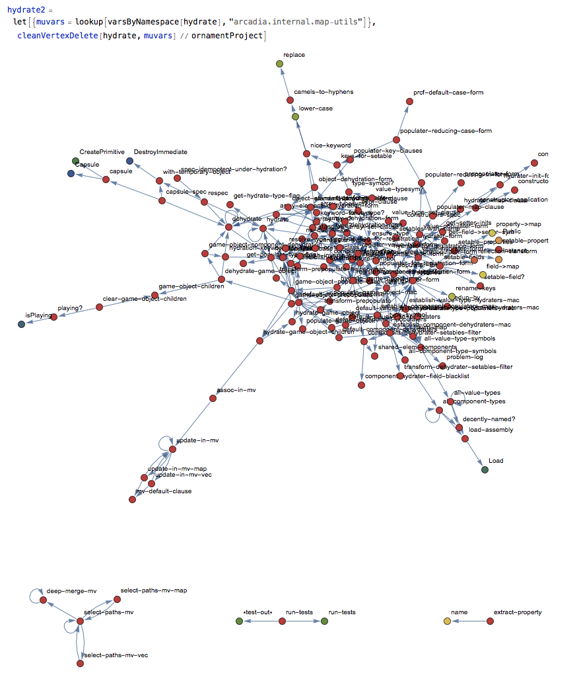
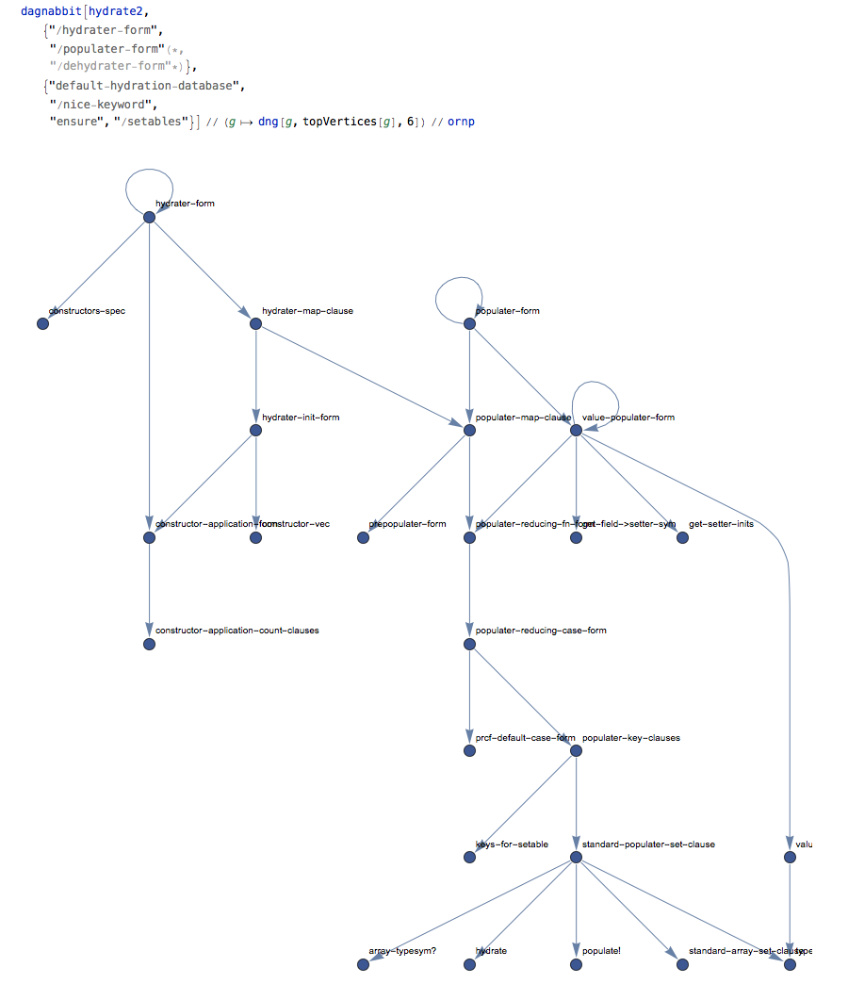

# mathematica-clojure-analysis

Unimaginatively named suite of tools for analyzing Clojure (at the moment) source code using Mathematica's lovely graph theoretical and visualization support.

## Status

For the moment this library refers to a fork of [ClojureLink](https://github.com/kovasb/ClojureLink). If any of the world's three or four users of both Clojure and Mathematica want to use this library for their own work, I'd be happy to take a weekend to make this package usable by non-Tims persons. In the meantime, here are some screenshots of all the fun I'm having.

Basic visualization of a codebase can be a little helpful, but large codebases don't make pretty graphs:

However, with a bit of interactive trimming in Mathematica, the essential logic of a system shines through:

